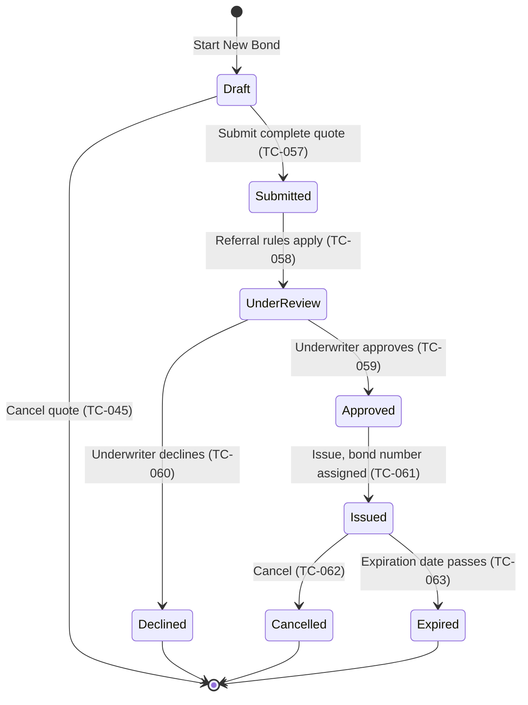

# Bond Lifecycle State Transitions

This model covers the bond lifecycle states from the brief. The test cases are TC-057 to TC-067 in `day-2/test-cases-additions.csv`. TC-045 in the workbook already covers Submit and Cancel from the quote form.

## State diagram

## Valid transitions

- **Draft to Submitted (TC-057):** A complete quote is submitted. Observed through the API on 2026-09-28: the execute call returns `Success: true` with a new BondId. In the UI path, DEF-002 currently blocks this.
- **Submitted to Under Review (TC-058):** Observed through the API on 2026-09-28: a $40,000,000 bond is returned with status "Referred". This model treats Referred as Under Review; that mapping needs confirmation.
- **Under Review to Approved (TC-059)** and **Under Review to Declined (TC-060):** Underwriter decisions. Expected behaviour to confirm.
- **Approved to Issued (TC-061):** A bond number is assigned. Observed: BondNumber is null at submission.
- **Issued to Cancelled (TC-062)** and **Issued to Expired (TC-063):** Expected behaviour to confirm.

## Invalid transitions

Each of these must be blocked, and the bond must keep its status.

- **Declined to Issued (TC-064)**
- **Cancelled to Approved or Issued (TC-065)**
- **Draft to Issued without Submit and review (TC-066)**
- **Expired to Issued (TC-067)**, unless a renewal is created

## Login lockout states

The Login lockout states are covered separately by TC-011 to TC-014:

- Signed Out
- First failed attempt
- Second failed attempt
- Locked Out
- A valid login while locked stays Locked Out
